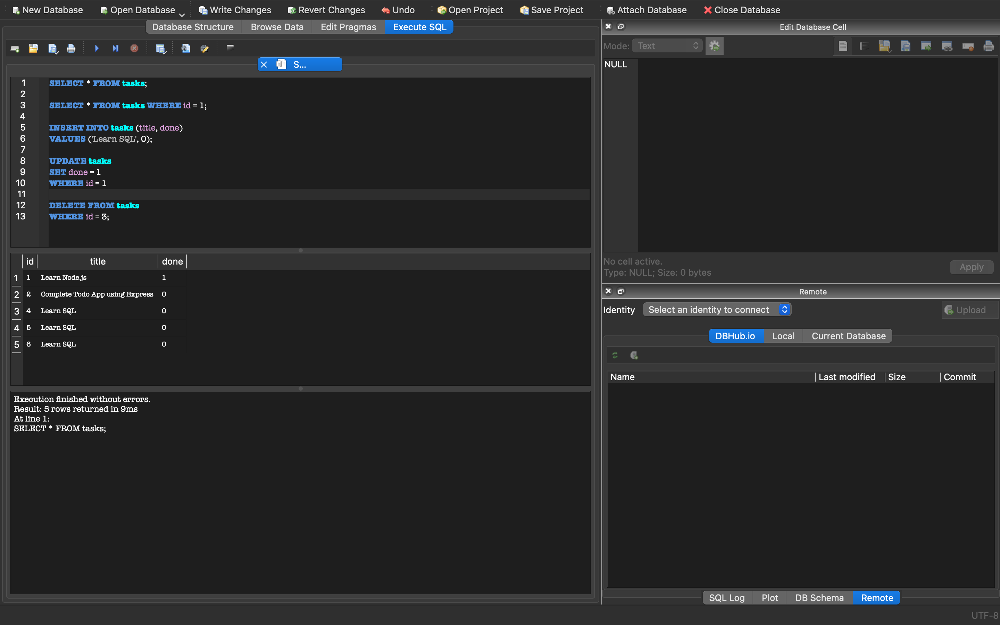

# Todo API

A simple Todo REST API built with Node.js and Express, backed by SQLite.

## Installation

Clone the project and install the dependencies:

```bash
npm install
```

## Run

Start the server with:

```bash
node server.js
```

The API runs at:

```
http://localhost:3002
```

Expected output:

```
Server is running on port 3002
```

## Endpoints

| Method | Endpoint     | Description                  | Body                    |
| ------ | ------------ | ----------------------------- | ------------------------ |
| GET    | `/`          | Check if the API is running   | None                     |
| GET    | `/tasks`     | Get all tasks                 | None                     |
| GET    | `/tasks/:id` | Get a task by ID              | None                     |
| POST   | `/tasks`     | Create a new task             | `{"title":"Buy milk"}`   |
| PUT    | `/tasks/:id` | Update a task                 | `{"title":"...","done":true}` |
| DELETE | `/tasks/:id` | Delete a task                 | None                     |

## Example: create a task

```bash
curl -i -X POST http://localhost:3002/tasks \
  -H "Content-Type: application/json" \
  -d '{"title":"Buy milk"}'
```

Expected output:

```
HTTP/1.1 201 Created
X-Powered-By: Express
Content-Type: application/json; charset=utf-8

{"id":4,"title":"Buy milk","done":false}
```

## Swagger

The API is documented using OpenAPI. Visit `/docs` once the server is running to see interactive documentation for every endpoint.

### Swagger screenshot


## Database

**Why SQLite:** SQLite was chosen because it needs no separate database server, it's a single file, which keeps the project simple for local development while still being real SQL rather than an in memory array.

**Where the database lives:** `tasks.db`, at the root of the project alongside `server.js`. It's created automatically on first run if it doesn't already exist, and the `tasks` table is created automatically if missing.

**How to run:**

```bash
node server.js
```

**Example query run by hand in DB Browser:**

```sql
SELECT * FROM tasks;
```

Output:

```
id  title                                done
2   Complete Todo App using Express     0
4   Learn SQL                           0
5   Learn SQL                           0
6   Learn SQL                           0
```

### Database viewer screenshot




## Persistence Verification

I verified that PostgreSQL data survives restarting the application
and database containers.

1. Started both containers:

   docker compose up -d --build

2. Created test tasks using the API:

   curl -i -X POST http://localhost:3002/tasks \
     -H "Content-Type: application/json" \
     -d '{"title":"Test persistence"}'

   curl -i -X POST http://localhost:3002/tasks \
     -H "Content-Type: application/json" \
     -d '{"title":"Restart containers"}'

3. Confirmed the tasks existed:

   curl -i http://localhost:3002/tasks

4. Restarted both actual containers:

   docker compose restart app postgres

5. Requested the tasks again:

   curl -i http://localhost:3002/tasks

6. The previously created tasks were still present.

7. I also tested persistence across container recreation:

   docker compose down
   docker compose up -d

8. I ran GET /tasks again and confirmed the tasks were still present.

The PostgreSQL data persisted because the database uses the named
`postgres_data` Docker volume mounted at `/var/lib/postgresql/data`.

9. Keep the postgres Config folder in the dir if you might want to resuse sqlite-3