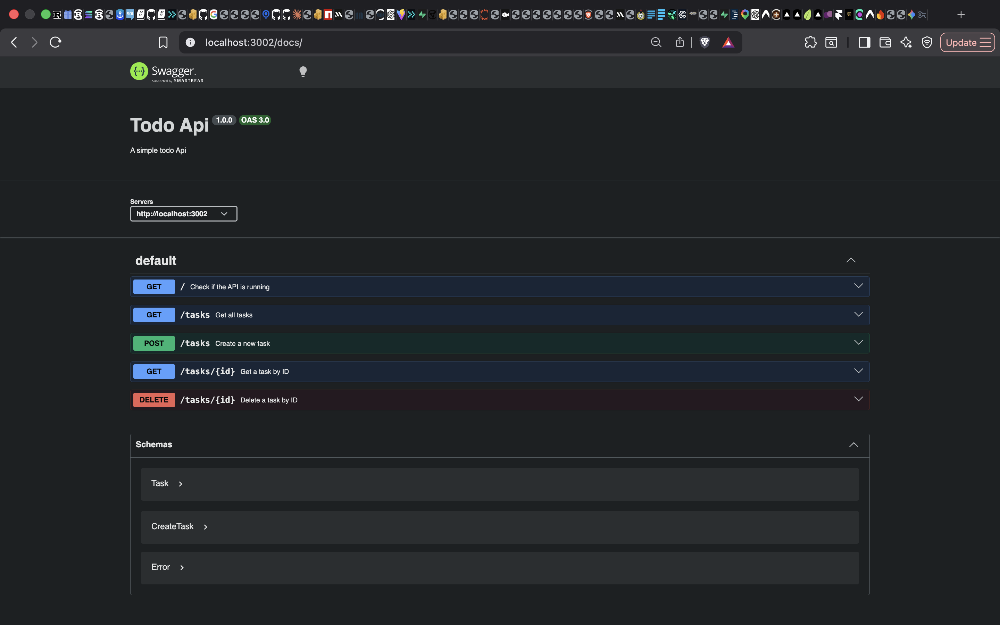

# Todo API

A simple Todo REST API built with Node.js and Express.

## Installation

Clone the project and install the dependencies:

```bash
npm install
```

## Run

Start the server with:

```bash
node server.js
```

The API runs at:

```
http://localhost:3002
```

Expected output:

```
Server is running on port 3002
```

## Endpoints

| Method | Endpoint     | Description                  | Body                    |
| ------ | ------------ | ----------------------------- | ------------------------ |
| GET    | `/`          | Check if the API is running   | None                     |
| GET    | `/tasks`     | Get all tasks                 | None                     |
| GET    | `/tasks/:id` | Get a task by ID              | None                     |
| POST   | `/tasks`     | Create a new task             | `{"title":"Buy milk"}`   |
| PUT    | `/tasks/:id` | Update a task                 | `{"title":"...","done":true}` |
| DELETE | `/tasks/:id` | Delete a task                 | None                     |

## Example: create a task

```bash
curl -i -X POST http://localhost:3002/tasks \
  -H "Content-Type: application/json" \
  -d '{"title":"Buy milk"}'
```

Expected output:

```
HTTP/1.1 201 Created
X-Powered-By: Express
Content-Type: application/json; charset=utf-8

{"id":4,"title":"Buy milk","done":false}
```

## Swagger

The API is documented using OpenAPI. Visit `/docs` once the server is running to see interactive documentation for every endpoint.

### Swagger screenshot


