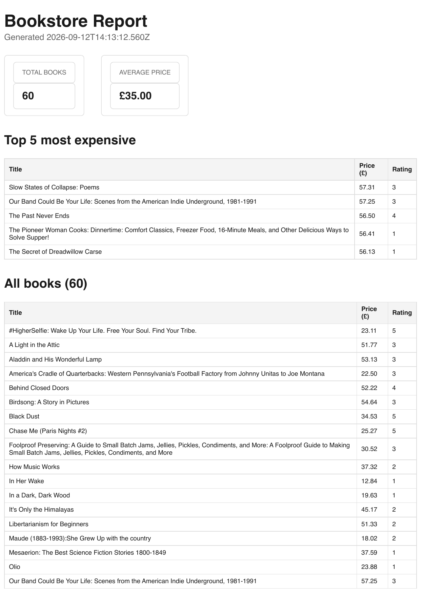

# Todo API

A simple Todo REST API built with Node.js and Express, backed by SQLite.

## Installation

Clone the project and install the dependencies:

```bash
npm install
```

## Run

Start the server with:

```bash
node server.js
```

The API runs at:

```
http://localhost:3002
```

Expected output:

```
Server is running on port 3002
```

## Endpoints

| Method | Endpoint     | Description                  | Body                    |
| ------ | ------------ | ----------------------------- | ------------------------ |
| GET    | `/`          | Check if the API is running   | None                     |
| GET    | `/tasks`     | Get all tasks                 | None                     |
| GET    | `/tasks/:id` | Get a task by ID              | None                     |
| POST   | `/tasks`     | Create a new task             | `{"title":"Buy milk"}`   |
| PUT    | `/tasks/:id` | Update a task                 | `{"title":"...","done":true}` |
| DELETE | `/tasks/:id` | Delete a task                 | None                     |

## Example: create a task

```bash
curl -i -X POST http://localhost:3002/tasks \
  -H "Content-Type: application/json" \
  -d '{"title":"Buy milk"}'
```

Expected output:

```
HTTP/1.1 201 Created
X-Powered-By: Express
Content-Type: application/json; charset=utf-8

{"id":4,"title":"Buy milk","done":false}
```

## Swagger

The API is documented using OpenAPI. Visit `/docs` once the server is running to see interactive documentation for every endpoint.

### Swagger screenshot


## Database

**Why SQLite:** SQLite was chosen because it needs no separate database server, it's a single file, which keeps the project simple for local development while still being real SQL rather than an in memory array.

**Where the database lives:** `tasks.db`, at the root of the project alongside `server.js`. It's created automatically on first run if it doesn't already exist, and the `tasks` table is created automatically if missing.

**How to run:**

```bash
node server.js
```

**Example query run by hand in DB Browser:**

```sql
SELECT * FROM tasks;
```

Output:

```
id  title                                done
2   Complete Todo App using Express     0
4   Learn SQL                           0
5   Learn SQL                           0
6   Learn SQL                           0
```

### Database viewer screenshot


## Bank/PTSP Name Normalization

`POST /normalize` takes a messy, free-text bank or PTSP name — the kind you actually see in PTSA reporting data (misspellings, abbreviations, legal-entity suffixes) — and maps it to exactly one canonical name from a fixed list of nine values (`ACCESS BANK`, `GTBANK`, `UBA`, `ZENITH BANK`, `FIRST BANK`, `OPAY`, `MONIEPOINT`, `PALMPAY`, `OTHERS`). It never invents a name outside that list and never returns free text; when the input is ambiguous or refers to an entity not on the list, it returns `OTHERS` with confidence below 0.5 instead of guessing.

As of the Background Jobs update below, this now runs as an Inngest background job instead of a synchronous call — see [Background Jobs (Inngest)](#background-jobs-inngest) for the current request/response shape (`202` + poll). The example below shows the original synchronous contract for reference.

```bash
curl -i -X POST http://localhost:3002/normalize \
  -H "Content-Type: application/json" \
  -d '{"raw_name":"GT bank plc"}'
```

Expected output (synchronous version):

```
HTTP/1.1 200 OK
Content-Type: application/json; charset=utf-8

{"canonical_name":"GTBANK","confidence":0.85,"reason":"GT bank plc is a common informal rendering of GTBank."}
```

**Job card:** see [job-card.md](./job-card.md).

**Provider/model:** OpenRouter. Free-tier `:free` models rotate in and out of availability, so the model in `.env` has changed a few times during development (currently `nvidia/nemotron-3.5-lightning:free`); the eval score and cost estimate below were measured against `minimax/minimax-m2.7:free` before it was pulled from the free tier. The prompt lives in [prompts/normalize-v1.md](./prompts/normalize-v1.md) and is sent as the system message; the raw name is sent as the user message, never glued into the system prompt.

**Environment:** copy `.env.example` to `.env` and set `LLM_API_KEY` to your own OpenRouter key. `LLM_STUB=1` returns a hardcoded valid response with zero model calls (used for testing input validation and wiring). `LLM_ENABLED=false` is a kill switch that returns a safe `OTHERS`/confidence-0 fallback, also with zero model calls.

**Reliability:** requests time out at 30s. Only timeouts, 429s, and 5xxs are retried (exponential backoff with jitter, max 2 retries); 400/401/403 fail immediately. A model response that fails schema validation gets one repair retry (the broken output plus the exact validation error is sent back); if that also fails, the caller gets a clean 422 and the full exchange is appended to `logs/quarantine.jsonl` for review. Raw model text is never returned to the caller. Every call (tokens, duration, model, attempt count) is logged to `logs/llm-calls.jsonl`.

**Eval score:** 8/8 on `evals/cases.json`, run 2026-09-04 against `minimax/minimax-m2.7:free`. Run it yourself with `node evals/run.js`.

**Cost estimate at 10,000 requests/day:** the free-tier model costs $0 but is rate-limited and not suitable at this volume. On the paid tier of the same model (~458 prompt + ~176 completion tokens/call observed, $0.30/$1.20 per M tokens respectively), that's roughly $0.00035/call → **~$3.50/day (~$105/month)**. Switching to `openai/gpt-4o-mini` ($0.15/$0.60 per M tokens) drops that to roughly **~$1.75/day (~$52/month)** at the same token volume.

**What I'd fix with another day:** the repair-retry prompt re-sends the entire broken JSON and error inline as a user message rather than using the provider's structured-output/JSON-mode feature (not all OpenRouter models expose it consistently), which would make schema failures rarer in the first place instead of relying on a second round-trip.

## Background Jobs (Inngest)

`/normalize` used to call the LLM synchronously inside the request/response cycle. It now enqueues a background job with [Inngest](https://www.inngest.com/) and returns immediately, so a slow or retried model call never holds an HTTP connection open. This is the same pattern as the Bookstore Report pipeline above, but wrapping a real LLM call instead of a fixed sleep.

### Running it

You need two terminals:

```bash
# terminal 1 — the API server
node server.js

# terminal 2 — the Inngest Dev Server (dashboard + local event/run queue)
npx inngest-cli@latest dev -u http://localhost:3002/api/inngest --port 8288
```

The Dev Server dashboard is at `http://localhost:8288`. Set `INNGEST_DEV=1` in `.env` (already in `.env.example`) so the app runs in local dev mode without a signing key.

### Endpoints and functions

| Type | Name | Trigger | Purpose |
|---|---|---|---|
| Endpoint | `POST /normalize` | HTTP | Validates input, creates a `pending` job, sends a `normalize/requested` event, returns `202` immediately |
| Endpoint | `GET /normalize/:id` | HTTP | Returns the job's current state: `pending`, `done` (with result), or `failed` (with error) |
| Function | `do-normalize` | event `normalize/requested` | Runs the actual LLM normalization inside `step.run`, then saves the result |
| Function | `normalize-heartbeat` | cron `* * * * *` | Logs a one-line `pending/done/failed` job count every minute; not wired to any endpoint |
| Function | `say-hello` | event `test/say-hello` (dev only) | Throwaway function used in Stage 1 to prove the Inngest wiring worked before touching real code |

### Proof: 202 then poll to done

```
$ curl -s -w "\nHTTP_STATUS:%{http_code}\n" -X POST http://localhost:3002/normalize \
    -H "Content-Type: application/json" -d '{"raw_name":"GTB"}'
{"id":"82e60737-51f5-4511-9113-76d1020b71ad","status":"pending"}
HTTP_STATUS:202

$ curl -s http://localhost:3002/normalize/82e60737-51f5-4511-9113-76d1020b71ad
{"id":"82e60737-51f5-4511-9113-76d1020b71ad","raw_name":"GTB","status":"pending"}

# a few seconds later
$ curl -s http://localhost:3002/normalize/82e60737-51f5-4511-9113-76d1020b71ad
{"id":"82e60737-51f5-4511-9113-76d1020b71ad","raw_name":"GTB","status":"done","canonical_name":"GTBANK","confidence":0.95,"reason":"GTB is a common abbreviated form of GTBank."}
```

Bad input is still rejected synchronously before any job or event is created:

```
$ curl -s -w "\nHTTP_STATUS:%{http_code}\n" -X POST http://localhost:3002/normalize -d '{}'
{"error":"raw_name is required and must be a string between 1 and 100 characters"}
HTTP_STATUS:400
```

### Two retry layers, and why both stay

There are now two independent retry mechanisms wrapping the same LLM call, and I kept both on purpose:

- **`src/llm/client.js`'s own retry loop** (unchanged from before Inngest) retries a single attempt up to 2 times, only for timeouts/429/5xx, with backoff+jitter measured in hundreds of milliseconds to a few seconds. This layer exists because those failure modes are often resolved by retrying within the same second or two — there's no reason to pay Inngest's much coarser retry delay for a transient blip that a quick local retry would fix, and it keeps the "normal" path fast.
- **Inngest's step-level retry** (`step.run('call-model', ...)`, default 4 retries) is a coarser, much slower safety net on top. It retries the *entire* `bankNormalizer.normalize()` call — including the client's own retry loop — on any uncaught error, with its own exponential backoff (attempts were spaced from instant up to multiple minutes apart in testing). This layer exists for failures the client layer deliberately doesn't retry (auth errors, exhausted client retries, or a crash anywhere else in `normalize()`), and for durability: if the app process restarts mid-job, Inngest still knows the step needs to run again.

They don't conflict because they're retrying different things at different granularities: the client layer is "is this one HTTP call worth retrying immediately," and the Inngest layer is "did the whole unit of work succeed at all, and if not, keep the job alive and try again later." Removing the client layer would mean every transient 429 pays Inngest's much slower backoff; removing the Inngest layer would mean a truly broken key or a process crash leaves the job stuck in `pending` forever with no record of failure.

### Stage 3: forcing a real failure

I temporarily broke `LLM_API_KEY` in `.env` (invalid key → OpenRouter returns `401 User not found`) and sent a valid request. Since 401 is explicitly non-retryable in `src/llm/client.js`, each individual attempt failed fast (~500-700ms) with zero client-side retries — but `step.run` still saw an uncaught error each time, so Inngest retried the step itself. The run went through **5 total attempts** (1 initial + Inngest's default 4 retries), spaced out over Inngest's own exponential backoff (about 4.5 minutes from first attempt to the run being marked `Failed`), confirmed via the Dev Server's `GET /v1/runs/:id`. Once retries were exhausted, the `onFailure` handler fired and wrote `status: "failed"` with the underlying error message to the job record, which `GET /normalize/:id` then returned. I restored the real key afterward and confirmed a normal request completes end-to-end again.

Throughout this, bad input (missing `raw_name`) kept returning a clean synchronous `400` with no Inngest event ever sent — that check happens before the job is created, so it's unaffected by whether the LLM key is healthy.

### Stage 4: heartbeat

`normalize-heartbeat` runs on a `* * * * *` cron, independent of any HTTP request, and logs `[normalize-heartbeat] pending=<n> done=<n> failed=<n>` using the same in-memory job store the endpoints read from. After the Stage 3 failure test and a follow-up successful request, a heartbeat tick correctly logged `pending=0 done=1 failed=0` (the failed job's count reset because the in-memory store is cleared on server restart, which happened between the two tests).

### Dashboard screenshots

_(To add: a completed `do-normalize` run, a failed run showing the 5 retry attempts, and a few `normalize-heartbeat` ticks, captured from `http://localhost:8288`.)_

### What's next

The job store (`src/inngest/normalizeJobs.js`) is an in-memory `Map`, so job state is lost on server restart — fine for this exercise, but a real deployment would persist jobs the same way the Bookstore Report pipeline persists reports (a SQLite/Postgres table), so `GET /normalize/:id` survives restarts and multiple app instances can share job state.

## Persistence Verification

I verified that PostgreSQL data survives restarting the application
and database containers.

1. Started both containers:

   docker compose up -d --build

2. Created test tasks using the API:

   curl -i -X POST http://localhost:3002/tasks \
     -H "Content-Type: application/json" \
     -d '{"title":"Test persistence"}'

   curl -i -X POST http://localhost:3002/tasks \
     -H "Content-Type: application/json" \
     -d '{"title":"Restart containers"}'

3. Confirmed the tasks existed:

   curl -i http://localhost:3002/tasks

4. Restarted both actual containers:

   docker compose restart app postgres

5. Requested the tasks again:

   curl -i http://localhost:3002/tasks

6. The previously created tasks were still present.

7. I also tested persistence across container recreation:

   docker compose down
   docker compose up -d

8. I ran GET /tasks again and confirmed the tasks were still present.

The PostgreSQL data persisted because the database uses the named
`postgres_data` Docker volume mounted at `/var/lib/postgresql/data`.

9. Keep the postgres Config folder in the dir if you might want to resuse sqlite-3

## Bookstore Report

Generates a PDF report (totals, top 5 most expensive, full book list) from
book data pulled out of my [Books to Scrape scraper](https://github.com/Slamanii/Scrapescrape) —
real scraped data, not made-up shop orders. Own SQLite file (`report.db`),
separate from `tasks.db`.

**Setup:**

```bash
npm install
npx playwright install chromium
npm run seed
node server.js
```

`npm run seed` reads `data/books.json` (a copy of the scraper's output,
committed here so the project runs standalone) and does a delete-all-then-
insert into the `books` table, so running it more than once never doubles
your rows.

**The four aggregations** (`src/reports/getReportData.js`):

```sql
SELECT COUNT(*) AS total FROM books;

SELECT AVG(price) AS average_price FROM books;

SELECT title, price, rating, url FROM books ORDER BY price DESC LIMIT 5;

SELECT rating, COUNT(*) AS count FROM books GROUP BY rating ORDER BY rating;
```

I cross-checked all four against the raw scraped JSON directly (not just
against the DB) before trusting them — rating counts came out
`{1: 15, 2: 8, 3: 13, 4: 10, 5: 14}` both ways, summing to 60.

**Generating a report:**

```bash
curl -i -X POST http://localhost:3002/reports
```

First call of the day: `201`, new PDF written to `reports/`, row inserted
into the `reports` table. Calling it again the same day returns the
existing report with `200` instead of generating a new one:

```bash
curl -i -X POST http://localhost:3002/reports   # 201, id 1
curl -i -X POST http://localhost:3002/reports   # 200, same id 1
curl -i -X POST http://localhost:3002/reports \
  -H "Content-Type: application/json" -d '{"force":true}'  # 201, new id
```

```
GET  /reports/:id        -> the report row (id, path, created_at)
GET  /reports/:id/file   -> the actual PDF bytes
```

`GET /reports/:id/file` is the only endpoint that ever moves real file
bytes off disk — everything else in this API stays JSON.

**Why this is inline and not a background job:** report generation here
takes a couple of seconds (SQL + Playwright launching a real headless
Chromium), so `POST /reports` just blocks and returns once it's done —
the brief for this assignment says that's fine at this scale. I'd move
this onto the queue I already built in this repo's earlier stages once
report generation regularly exceeds a few seconds or runs for many
concurrent users at once.

**Page-break trap:** the first render I generated had the header row of
the "all books" table only appearing on page 1 — normal for an HTML table
across a PDF page break. Fixed by wrapping the header in `<thead>` (repeats
per page) and setting `tr { break-inside: avoid; }` so no row gets sliced
across the boundary. Sample below is page 1 of a 3-page report over all 60
books:



`report.db` and `reports/` are gitignored — neither the SQLite file nor
generated PDFs are committed, only the code and the `data/books.json`
fixture needed to seed it.